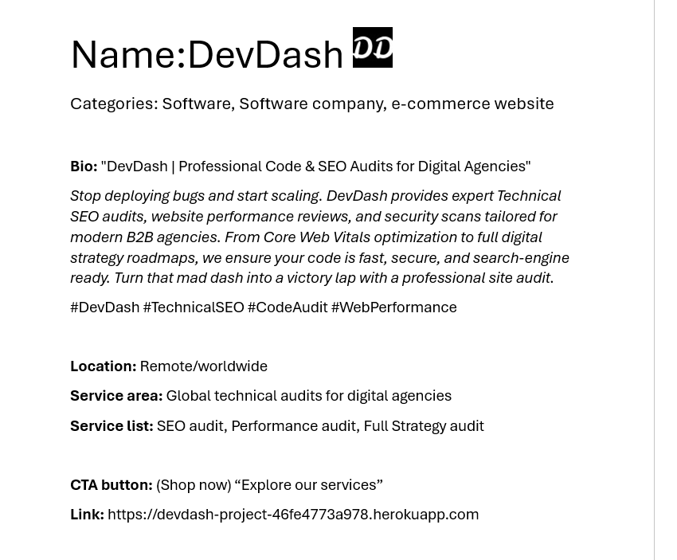
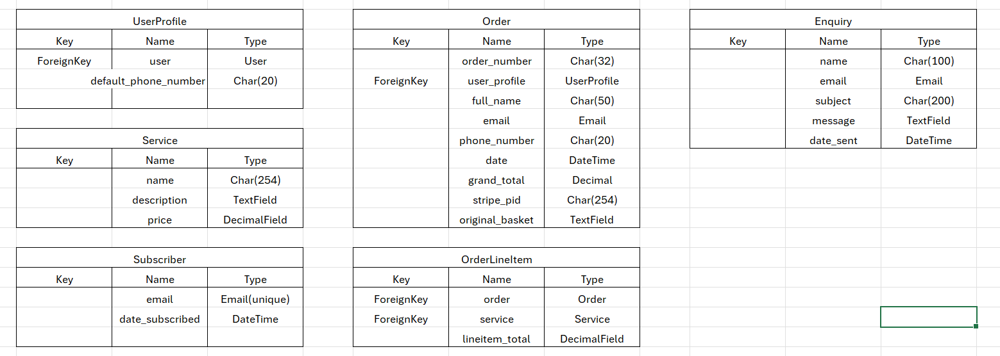
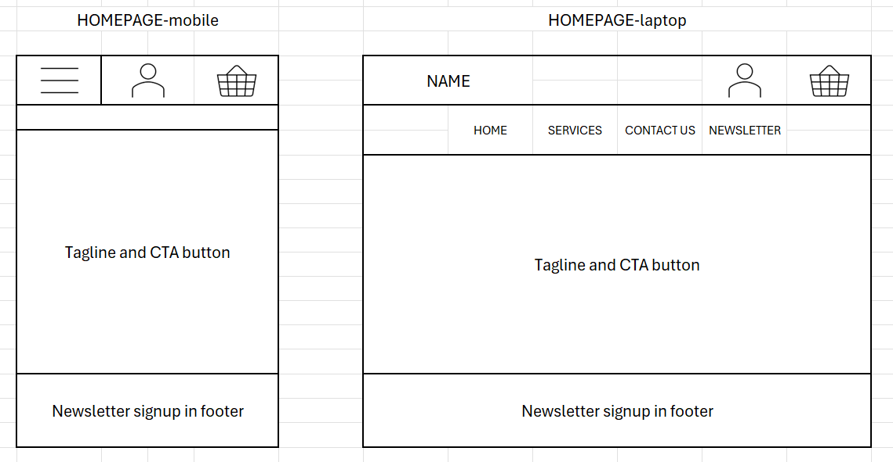
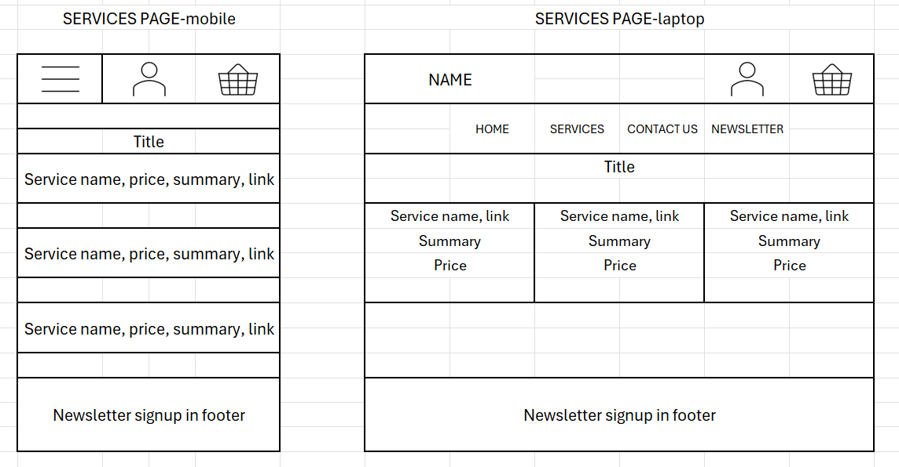
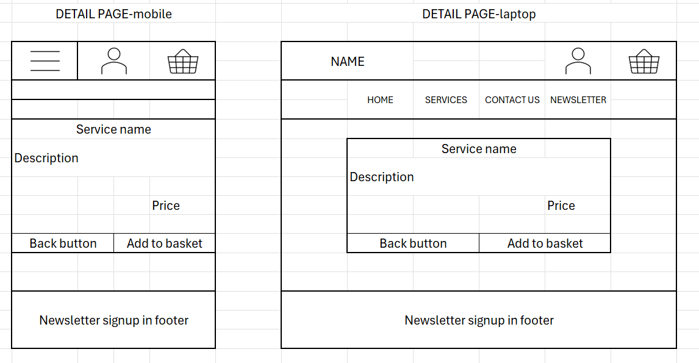

# DEVDASH Project
DevDash is a B2B agency selling one-off digital audits to other businesses. Marketing strategy includes an email newsletter for lead retention and a facebook business page for brand awareness. Here is a mockup:

The newsletter signup is in the footer:

## User stories
As the project evolved, user stories were ranked to create an MVP, prioritising site navigation and CRUD functionality.
[Kanban board](https://github.com/users/henrytitheridge-stone/projects/10/views/1)

## Database
Here are the ERDs for the UserProfile, Service, Subscriber, Order, OrderLineItem and Enquiry models:

## Design
The design for the project was built on a minimalist, high-contrast aesthetic for a professional feel without clutter. The main nav and footer are in black to frame the content and the main background is white for a clean workspace feel. Lato font was chosen for clean, sharp legibility and titles and headers are emphasised in bold uppercase. Bold black borders and sharp square corners reflect technical documentation and digital business. Default bootstrap classes ensured full responsivity. The following wireframes were used as initial outlines for the home, service and service detail pages:

## Features
- Service Management (CRUD): Site owners can Create, Read, Update, and Delete service audits directly through the front-end UI.
- User Profiles: Authenticated users have a personal dashboard to manage their default contact info and view their order history.
- Shopping Basket: Users can add audits to a persistent basket and view a real-time summary of their total.
- Secure Checkout: Integrated with Stripe to process real-world payments and generate unique order confirmations.
- Lead Capture: Custom-built Newsletter signup and Contact Enquiry forms to gather B2B leads.
- Responsive Design: A minimalist, mobile-first UI built with Bootstrap 4 to ensure the site is accessible on all devices.

## Key technical choices
- Django Signals: Used to automatically create or update a User Profile whenever a User account is created.
- Context Processors: Used to make the shopping basket contents available on every page of the site.
- Stripe Webhooks: Implemented to ensure that even if a user closes their browser during checkout, the order is still safely recorded in our database.

## Manual testing
| Feature area | Test case description | User status | Expected outcome | Result |
| ------------ | --------------------- | ----------- | ---------------- | ------ |
| Site Nav | Click all links in header and page buttons | Any | Navigate to correct pages without 404s | Pass |
| Search |	Browse the Services list  |	Any | All 3 displayed | Pass |
| Service Detail | Click on a service card | Any | Open detail view with unique price/description | Pass |
| Basket Add | Click "Add to Basket" on detail page | Any | Item added to session; Success Toast shown | Pass |
| Basket view | Navigate to Basket page | Any | Item list, subtotal, and grand total are correct | Pass |
| Basket Remove | Click "Remove" link in basket | Any | Item removed; total updates to $0.00 | Pass |
| Checkout UI | Navigate to Checkout page | Any | Order summary and Stripe element load correctly | Pass |
| Stripe Pay | Enter test card and click "Complete Order" | Any | Webhook processes; Order Success page loads |
| Registration | Complete the Signup form | Guest | Account created; message displayed | Pass |
| Login | Enter valid credentials | User | User logged in; "My Profile" link appears | Pass |
| User Profile | Update phone number in Profile form | User | Database updates; Success Toast appears | Pass |
| Order History | View Profile dashboard | User | List of all previous orders is displayed | Pass |
| Newsletter | Enter email in footer and subscribe | Any | Email saved to DB; Success Toast shown | Pass |
| Contact form | Submit an enquiry via Contact page | Any | Form validates; Enquiry saved to Admin panel | Pass |
| Admin CRUD | 	Add/Edit a Service via frontend form | Superuser | Changes appear immediately on the storefront and db | Pass |
| Admin Delete | Click "Delete" on a Service | Superuser | Service removed from DB and UI | Pass |
| Security 1 | Manually access /profile/ URL | Guest | Blocked and redirected to Login page | Pass |
| Security 2 | Manually access /services/add/ | User | Blocked; Error message: "Only site owners..." | Pass |
| Error 404 | Enter an invalid URL path | Any | Custom 404 page loads with "Back to Home" link |

## Validation

## Development & Deployment
- The site was built using Visual Studio Code connected to GitHub via the steps below:
    - Created a local project folder in VS Code and a GitHub repository with the same name
    - Copied the GitHub commands to 'create a new repository on the command line'
    - Pasted and ran these through a new terminal in VS Code
        - This initialised git, made a readme file and pushed a first commit to GitHub

- A virtual environment, Django project and app were created and activated via the steps below:
    - Chose ‘Python: Create environment...’ from the VS Code command palette
    - Selected ‘Venv’, ‘Python 3.12’ and ‘requirements.txt’ to install dependencies
    - Added ‘.venv’ to the ‘.gitignore’ file to exclude it from version control
    - Ran the following commands to install Django, list dependencies, and start a new project:
        - pip3 install Django~=4.2.1
        - pip3 freeze local > requirements.txt
        - django-admin startproject readable .
    - Started the new app by running: python manage.py startapp catalogue
    - Added this to the INSTALLED_APPS in settings.py

- Throughout the project, changes made in VS Code were regularly saved and shared by:
    - Entering 'git add .' into a terminal to stage all changes
    - Entering 'git commit -m' with a succinct summary message to commit the changes
    - Entering 'git push' to push all local changes to the project's remote GitHub repository

### Initial deployment
- The site was initially deployed to Heroku via the steps below:
    - Implemented conditional logic in settings.py to ensure DEBUG is only True in a local development environment
    - Created a new app with the project name from the Heroku dashboard
    - Opened the Settings tab in the new app
    - Added a single config var with a key set to ‘DISABLE_COLLECTSTATIC’ and value of '1'

    - VS CODE: ensured a deployment-compatible server and both local and production hosting by:
        - Installing gunicorn by running: pip3 install gunicorn~=20.1
        - Adding a Procfile to the root directory and the code: web gunicorn readable.wsgi
        - Adding '.herokuapp.com' and '127.0.0.1' to the ALLOWED_HOSTS in settings.py

    - HEROKU: Selected the ‘Connect to GitHub’ deployment method in the Deploy tab
    - Searched for and selected the project repository name to establish the connection
    - Scrolled to 'Manual deploy' and selected 'Deploy branch' to build the live app
    - Above the tabs bar an 'Open app' link was provided to the hosted site

### Final deployment
- To maintain deployment-ready status as the project grew, a series of adjustments were needed:
#### Database
- The following steps were taken to connect to a new database and access the admin panel:
    - Created a PostgreSQL instance using the Code Institute login, emailed as a link
    - Pasted the url into a new env.py file as a setdefault("DATABASE_URL", ...)
    - Added env.py to the .gitignore to keep secure data from being pushed to GitHub
    - Connected the database by running:
        - pip3 install dj-database-url~=0.5 psycopg2~=2.9
        - pip3 freeze --local > requirements.txt
    - Imported env into the settings.py file to access the database url
    - Commented out the local sqlite3 database connection
    - Ran 'python manage.py migrate' to add default apps to the database
    - Ran 'python manage.py createsuperuser' and added details to login to the admin dashboard
- DEPLOYMENT: Added a DATABASE_URL config var to the Heroku app
#### Secret keys
- To secure the database, secret keys were generated and activated via the steps below:
    - Generated a random key and added it to a "SECRET_KEY" environment variable in env.py
    - Replaced the insecure SECRET_KEY in settings.py with the environment variable
- DEPLOYMENT: Added a SECRET_KEY config var to the Heroku app with a newly-generated key
##### Stripe
- Stripe API keys were also added to Heroku config vars and
- Webhooks were configured with a dedicated endpoint and signing secret on Heroku to ensure order processing is completed even if a user’s browser session is interrupted
#### Static files
- The following steps were taken to ensure static files loaded correctly on deployment:
    - Added a STATIC_ROOT path to 'staticfiles' underneath the STATIC_DIRS in settings.py
    - Installed whitenoise (to enable Heroku to run 'collectstatic' automatically) by:
        - Running 'pip3 install whitenoise~=5.3.0' and 'pip3 freeze --local > requirements.txt'
        - Adding the whitehoise MIDDLEWARE and backend STORAGES to settings.py
    - Ran 'python manage.py collectstatic' to create staticfiles directory and initial cache
    - Added 3.12 to .python-version file
- DEPLOYMENT: Removed DISABLE_COLLECTSTATIC config var from the Heroku app before re-deploying
#### Forms and HTTP methods
- Finally, the site was protected against Cross-Site Request Forgery by: 
    - Adding //localhost and //*.herokuapp.com domains to CSRF_TRUSTED_ORIGINS in settings.py
- DEPLOYMENT: This ensured that malicious sites would be prevented from tricking users' browsers into submitting unauthorised data to either the local or hosted site

